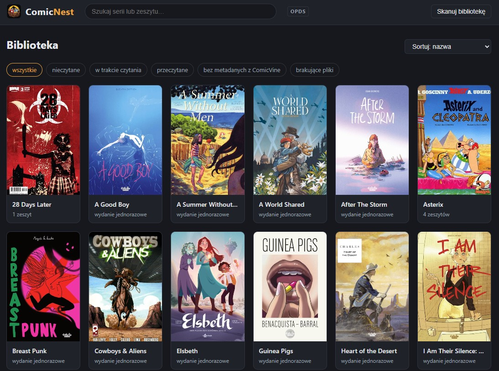
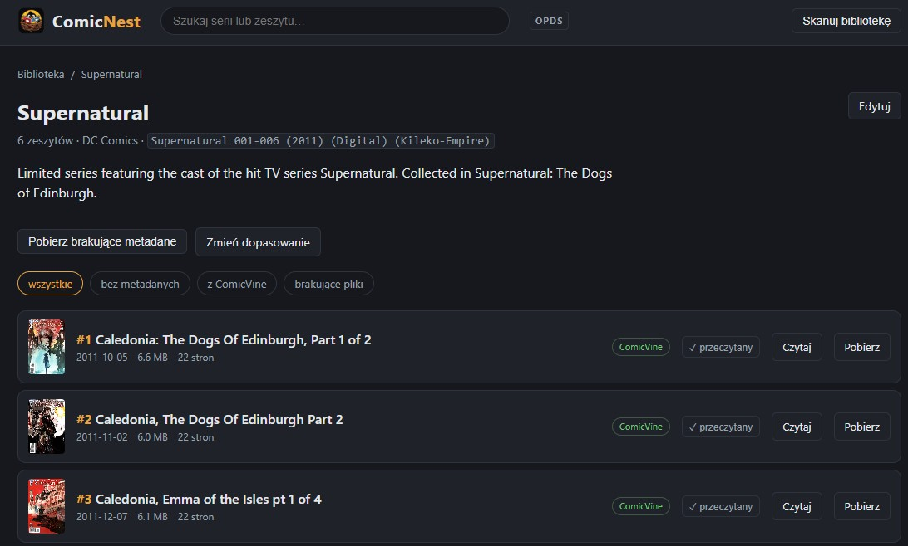
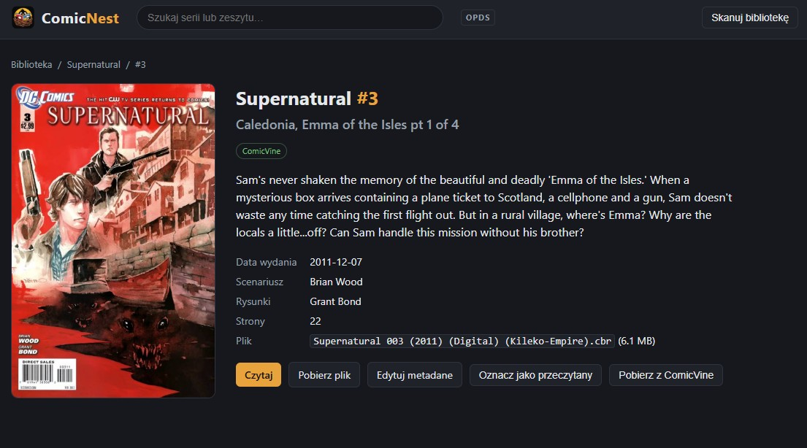

<p align="center">
  
</p>

<h1 align="center">ComicNest</h1>

<p align="center">Your comic collection as a personal web library — on your PC or NAS, in your browser and in your comic reader apps.</p>

---

ComicNest is a small self-hosted server for a personal comic library. Point it at the folder
where your `.cbz`, `.cbr` and `.pdf` files live, and it builds a catalog of series and issues
with covers, metadata and reading progress. Everything runs locally: one program, one config
file, no cloud account.

**What it does**

- **Scans your library** — folders become series, issue numbers and years are read from file
  names, and metadata embedded in the archives (`ComicInfo.xml`) is picked up automatically.
  Re-scanning finds new and missing files without creating duplicates.
- **Shows covers** taken from the first page of each archive, cached on disk.
- **Fetches metadata from ComicVine** — match a series to a ComicVine volume, then pull
  descriptions, publishers, release dates and cover art for a single issue or the whole series.
  Anything you edit by hand is locked and never overwritten by automatic updates.
- **Lets you browse and search** — a series grid with sorting, filters (unread, in progress,
  finished, missing ComicVine data, missing files) and pagination, series pages, issue details
  and direct downloads.
- **Reads comics in the browser** — a full-screen page reader for CBZ/CBR with zoom, keyboard,
  mouse and touch paging. It resumes where you left off and shares progress with your reader
  apps.
- **Serves an OPDS catalog** for comic reader apps on phones and tablets (Panels, Chunky,
  Moon+ Reader, Librera, KOReader, Thorium…). Readers can browse, search, download, or stream
  pages straight from the server without downloading the file.
- **Supports several users** — optional accounts with separate reading progress, used by both
  the web interface and the OPDS catalog.
- Dark theme, works without JavaScript.

## Screenshots

<p align="center">
  
</p>
<p align="center"><em>The library: every series as a tile, with sorting, reading filters and pagination.</em></p>

<table>
  <tr>
    <td align="center" width="50%">
      
      <br><em>A series: description from ComicVine, issue list with metadata source, read marks, read and download buttons.</em>
    </td>
    <td align="center" width="50%">
      
      <br><em>An issue: cover, summary, credits, file details and actions (read, download, edit, mark as read, fetch from ComicVine).</em>
    </td>
  </tr>
</table>

## Getting started

### 1. Download

Grab the file for your system from the **Releases** page on GitHub:

| System | File |
|---|---|
| Windows | `comicnest-windows-amd64.exe` |
| Linux (x64) | `comicnest-linux-amd64` |
| Linux (ARM, e.g. Raspberry Pi) | `comicnest-linux-arm64` |
| macOS (Apple Silicon) | `comicnest-darwin-arm64` |

The `latest` pre-release is always the newest build; numbered releases (`v1.2.0`) are the
stable ones. Prefer Docker? Skip to [Running with Docker](#running-with-docker).

### 2. First run

Put the file in a folder of its own and start it (double-click on Windows, or run it from a
terminal). The first start creates `config.yaml` next to it and stops with a hint. Open that
file, set `library` to your comics folder, and start the program again.

Now open **http://localhost:8080/** in your browser and click **Skanuj bibliotekę** (scan
library) in the top bar. The first scan of a large collection takes a while, because covers are
extracted and pages counted; a progress bar shows where it is. Later scans are much faster.

To start with a different config file location, run `comicnest -config /path/to/config.yaml`.

### 3. Configuration

All options live in `config.yaml`. A fully commented example is in the repository as
[`config_example.yaml`](config_example.yaml); you can copy it and edit. The keys:

```yaml
port: 8080                    # HTTP port of the server
listen: localhost             # "localhost" = this computer only; "0.0.0.0" = the whole local network (needed for OPDS reader apps)
library: "D:/Comics"          # root folder of your comics (scanned recursively: cbz / cbr / pdf)
data_dir: ./data              # runtime data: SQLite database and cover cache
comicvine_api_key: ""         # key from https://comicvine.gamespot.com/api/ — leave empty to disable ComicVine features
opds_enabled: false           # OPDS catalog at http://<host>:8080/opds for reader apps
page_size: 60                 # series tiles per page in the library grid; 0 = everything on one page
users:                        # accounts (optional); no section = no login, one anonymous reader
  - name: alice               # login name for the web UI and OPDS — must not contain ":"
    password: secret          # stored in plain text on purpose (personal app on a home network)
  - name: bob                 # every account has its own reading progress
    password: other
```

A few things worth knowing:

- **Opening the server to your network.** By default ComicNest listens on `localhost` only.
  Set `listen: 0.0.0.0` to reach it from phones, tablets and other computers. If you do that,
  add `users`, otherwise anyone on the network can edit your library.
- **User accounts.** With `users` defined, the web interface asks for a login and reader apps
  ask for the same name and password. Each user has their own progress: progress bars,
  "read" marks, filters and the "currently reading" list are personal. Progress recorded before
  accounts existed is assigned to the first user in the list.
- **ComicVine.** Without a key everything works, but matching and metadata download are
  disabled and the interface says so. Get a free key at comicvine.gamespot.com/api.
- **Environment variables.** Every key except `users` can be overridden with
  `COMICNEST_<KEY>` (for example `COMICNEST_LISTEN=0.0.0.0` or
  `COMICNEST_COMICVINE_API_KEY=…`). `COMICNEST_CONFIG` sets the config file path. Values from
  the environment win over the file. This is what the Docker image uses, but it works anywhere.

### 4. Organising your comics

The preferred layout is **one folder per series**:

```
D:/Comics/
├── Batman/
│   ├── Batman #001.cbz
│   └── Batman #002.cbz
└── Saga/
    └── Saga 055 (2020) (Digital).cbz
```

Loose files in the root folder are fine too; the series name is then taken from the file
name. Recognised patterns include `Title #012`, `Title 012 (2020)` and `Title v2 015`.
Bracketed groups after the number, such as `(Digital)`, are ignored, and a `(YEAR)` becomes
the release year. A single unnumbered file in its own folder is treated as a one-shot.

Metadata sources are ranked: **file name → ComicInfo.xml → ComicVine → your manual edits**.
A scan or a ComicVine update never overwrites data from a higher-ranked source, and a manual
edit locks the record (🔒) until you unlock it.

## Running with Docker

The image `ghcr.io/monsterartur1/comicnest` is about 15 MB and is built for `linux/amd64`
and `linux/arm64`, so it runs on x86 servers, Raspberry Pi and ARM-based NAS units. Tags:
`latest` is the newest build, `1.2.0` / `1.2` / `1` are stable releases.

The container uses three directories:

| Path in container | Purpose | Mount as |
|---|---|---|
| `/comics` | your comic library | read-only |
| `/config` | `config.yaml` | read-write |
| `/data` | SQLite database and cover cache | read-write, on a **local disk** (SQLite on SMB/NFS shares can corrupt) |

### docker-compose

Copy [`docker-compose.yml`](docker-compose.yml) from the repository, change the comics path
and the `PUID`/`PGID` values, and run:

```
docker compose up -d
```

```yaml
services:
  comicnest:
    image: ghcr.io/monsterartur1/comicnest:latest
    container_name: comicnest
    ports:
      - "8080:8080"
    volumes:
      - /path/to/your/comics:/comics:ro
      - ./config:/config
      - ./data:/data
    environment:
      # PUID: "1026"          # run as this user — see below
      # PGID: "100"
      TZ: Europe/Warsaw
      # Optional overrides; anything set here beats config.yaml:
      # COMICNEST_COMICVINE_API_KEY: ""
      # COMICNEST_OPDS_ENABLED: "true"
    healthcheck:
      test: ["CMD", "/comicnest", "-healthcheck"]
      interval: 30s
      timeout: 5s
      retries: 3
      start_period: 10s
    restart: unless-stopped
```

**PUID / PGID.** The container starts as root, gives ownership of `/config` and `/data` to
the user you specify, and then drops to that user before opening anything — the same
convention as linuxserver.io images, so your files end up owned by you, not by root. On a
Synology NAS use the UID of your account (usually `1026`; check with `id <username>` over
SSH) and GID `100` (the `users` group). On Unraid use `99` / `100`. If you leave both out,
the container keeps running as root.

**First start.** The container creates `config/config.yaml` with the right paths already
filled in (`listen: 0.0.0.0`, `library: /comics`, `data_dir: /data`). Add your accounts
and ComicVine key to that file, run `docker compose restart`, then open
`http://<your-host>:8080/` and click **Skanuj bibliotekę**.

**Updating.** `docker compose pull` followed by `docker compose up -d`. Database migrations
run automatically on start.

## Reader apps (OPDS)

Set `opds_enabled: true` and `listen: 0.0.0.0` (already the case in Docker), restart, and add
a catalog in your reader app with the address:

```
http://<address-of-your-server>:8080/opds
```

The catalog offers **all series** with covers, **currently reading**, **recently added** and
**search**. Readers that support page streaming (Panels, Chunky, Librera, Moon+ Reader…) open
CBZ/CBR issues directly from the server without downloading the file, resume at the last page,
and their progress shows up in the web interface as well. PDFs are download-only.

If you defined `users`, the reader will ask for a login and see that user's progress. On the
same computer (for example Thorium Reader on a PC) use `http://127.0.0.1:8080/opds` — Thorium
refuses `localhost`. The server prints all working addresses when it starts.
